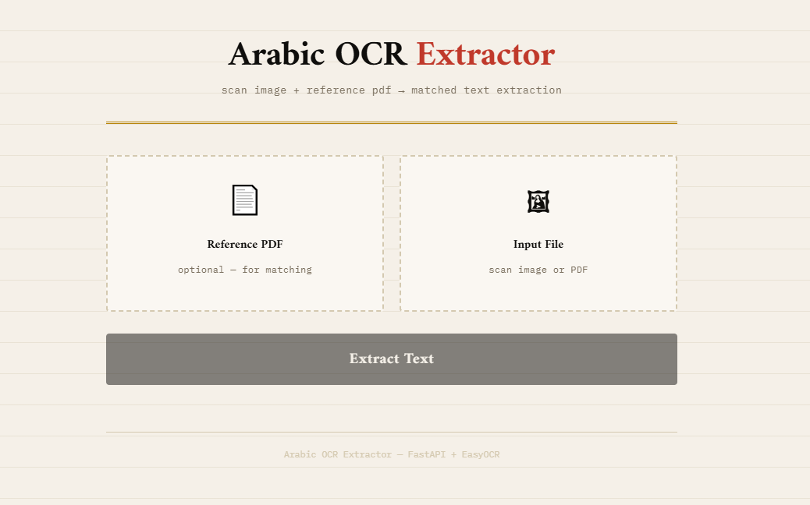

# Arabic OCR Extractor

Extracts Arabic text from scanned images or PDF files using EasyOCR, then matches the recognized lines against native PDF text blocks to produce clean HTML, plain text, summary, and a cropped PDF output preserving the original vector formatting.

---

## Project Structure

```
Arabic-OCR-Extractor/
├── main.py          # Entry point — orchestrates the full pipeline
├── ocr_engine.py    # Image preprocessing + EasyOCR recognition
├── pdf_handler.py   # PDF-to-image conversion + text block extraction + PDF assembly
├── matcher.py       # TF-IDF cosine similarity matching of OCR lines to PDF blocks
├── formatter.py     # Exports results to HTML, TXT, summary, and PDF
├── api.py           # FastAPI backend — wraps the pipeline as a REST API
├── static/
│   └── index.html   # Frontend UI — drag-and-drop upload + download links
├── requirements.txt
└── output/          # Created automatically — all result files land here
```

---

## How Each Component Works

### `ocr_engine.py` — Image Preprocessing & OCR

1. **Quality check** (`is_image_clean`): reads the image as grayscale and measures pixel mean and standard deviation. If the image is already bright and high-contrast (mean > 150, std > 30) preprocessing is skipped entirely.
2. **Cleaning** (`clean_image`): for low-quality images applies grayscale conversion → fast non-local means denoising → Otsu binarisation and saves the result to `input/preprocessed.jpg`.
3. **Upscaling & contrast boost** (`extract_from_image`): the ready image is scaled up 2.5× with cubic interpolation, then CLAHE is applied in LAB colour space to boost local contrast before passing to EasyOCR.
4. **EasyOCR recognition**: the Arabic-language reader runs with per-character detail so each word gets an individual bounding box and confidence score. Detections below 20 % confidence are dropped immediately.
5. **Line grouping**: detected word boxes are sorted by vertical centre. Words whose vertical centres fall within 60 % of the average line height of the current group are merged into one logical line.
6. **RTL ordering**: words within each line are sorted right-to-left (highest X first) so Arabic reads correctly when joined with spaces.

Output per line: `text`, `raw_text`, `bbox` [x0,y0,x1,y1], `confidence`, `page`.

---

### `pdf_handler.py` — PDF Utilities

**`pdf_to_images(pdf_path, dpi=200)`**
Renders every page of the PDF to a JPEG at 200 DPI using PyMuPDF (`fitz`) and saves them under `input/pdf_pages/`. Used in Mode 1 (PDF-only) so the pages can be fed to `ocr_engine`.

**`extract_pdf_blocks(pdf_path)`**
Opens the PDF with PyMuPDF and calls `page.get_text("blocks")` on every page to retrieve native text blocks with their bounding boxes. Arabic text is passed through `python-bidi` so display order matches visual order. These blocks are the targets for the matcher.

**`build_matched_pdf(source_pdf_path, matched_lines, output_path, padding=15)`**
Assembles the final result PDF:
- Keeps only lines with a positive match score that have a valid bbox and page reference.
- Groups lines by source page.
- Removes spatial outliers using the IQR method (1.5 × IQR fence on Y-centres) so a stray match cannot blow up the crop region.
- Computes the union bounding box of all matched regions on each page, adds `padding` points, and clamps to the page boundary.
- Creates a new page in the output document sized exactly to that region and copies the source PDF content with `show_pdf_page` — vectors, fonts and images are transferred without rasterisation.

---

### `matcher.py` — OCR-to-PDF Matching

1. **Normalisation** (`normalize_arabic`): strips diacritics (harakat), normalises alef variants (أإآا → ا), normalises ya/alef-maqsura (يى → ي), and normalises taa marbuta (ة → ه). This reduces mismatches caused by OCR inconsistency.
2. **TF-IDF vectorisation**: all OCR lines and all PDF blocks are vectorised together using character-level 2- and 3-grams (`TfidfVectorizer(analyzer='char', ngram_range=(2,3))`). Character n-grams are robust to word-boundary errors common in OCR.
3. **Cosine similarity**: pairwise cosine similarity is computed between the OCR matrix and the PDF matrix. Each OCR line is matched to the PDF block with the highest score.
4. **Threshold**: matches below 0.15 are considered unmatched (`match_score: 0.0`). Matched lines receive the PDF block's `bbox`, `page`, `page_width`, and `page_height`.

---

### `formatter.py` — Output Exporters

| Function | Output | Details |
|---|---|---|
| `export_to_html` | `output/result.html` | RTL HTML page with `dir="rtl"`, Arabic fonts, line separators. Lines with confidence < 50 % are rendered dimmed. |
| `export_to_text` | `output/result.txt` | One line of Arabic text per matched line, UTF-8. |
| `export_summary` | `output/summary.txt` | Human-readable table with text, confidence, bounding box, and match score for every line. |
| `export_to_pdf` | `output/result.pdf` | Delegates to `pdf_handler.build_matched_pdf` — exact vector copy of matched PDF regions. |

---

### `main.py` — Pipeline Entry Point

Three modes selected automatically based on the arguments:

| Mode | Trigger | Behaviour |
|---|---|---|
| **1 — PDF only** | `main.py doc.pdf` | Renders PDF pages → OCR → extract native blocks → match → export all four outputs |
| **2 — Image + PDF** | `main.py scan.jpg ref.pdf` | OCR the image → extract native blocks from reference PDF → match → export all four outputs |
| **3 — Image only** | `main.py scan.jpg` | OCR the image → no matching → export HTML, TXT, summary only (no PDF output) |

After OCR, any line shorter than 3 characters or with confidence below 35 % is dropped before matching.

---

### `api.py` — FastAPI Backend

Wraps the full pipeline as a REST API so it can be driven from the browser UI or any HTTP client.

**Endpoints:**

| Method | Path | Description |
|---|---|---|
| `POST` | `/process` | Accepts `input_file` (image or PDF) and optional `reference_pdf` as multipart form fields. Runs the full pipeline and returns JSON with OCR stats and download URLs. |
| `GET` | `/download/{filename}` | Serves a generated output file (`result.html`, `result.txt`, `summary.txt`, `result.pdf`). |
| `GET` | `/` | Serves the frontend UI from the `static/` directory. |

**Response format from `/process`:**
```json
{
  "status": "ok",
  "ocr_lines": 12,
  "matched": 9,
  "outputs": {
    "html":    "/download/result.html",
    "txt":     "/download/result.txt",
    "summary": "/download/summary.txt",
    "pdf":     "/download/result.pdf"
  }
}
```

---

### `static/index.html` — Frontend UI



**Features:**
- Drag-and-drop or click-to-browse for both the input file and optional reference PDF.
- Single **Extract Text** button POSTs to `/process`.
- Animated progress bar while the pipeline runs.
- Download cards appear for each output file once processing completes.
- Error messages displayed inline if the server returns a failure.

---

## Setup

```bash
# Clone or enter the project directory
cd Arabic-OCR-Extractor

# Create and activate a virtual environment
python3 -m venv venv
source venv/bin/activate          # Windows: venv\Scripts\activate

# Install dependencies
pip install -r requirements.txt
pip install fastapi uvicorn[standard] python-multipart
```

> **Note:** EasyOCR downloads the Arabic model weights (~200 MB) on first run. Subsequent runs use the cached model.

---

## Running

### Command Line

```bash
source venv/bin/activate
```

**Mode 1 — PDF document:**
```bash
python main.py document.pdf
```

**Mode 2 — Scanned image matched against a reference PDF:**
```bash
python main.py scan.jpeg reference.pdf
```

**Mode 3 — Image only (no PDF matching):**
```bash
python main.py scan.jpeg
```

### Web UI

```bash
# Create the static folder and place index.html inside it
mkdir static

# Start the API server
uvicorn api:app --reload --port 8000
```

Then open `http://127.0.0.1:8000` in your browser.

---

## Output Files

All files are written to the `output/` directory (created automatically).

| File | Description |
|---|---|
| `result.html` | RTL Arabic layout, open in any browser |
| `result.txt` | Plain UTF-8 text, one line per OCR line |
| `summary.txt` | Per-line confidence and match scores |
| `result.pdf` | Cropped PDF with exact original formatting (Modes 1 & 2 only) |

---

## Dependencies

| Package | Purpose |
|---|---|
| `easyocr` | Arabic OCR engine |
| `opencv-python` | Image preprocessing (denoising, thresholding, CLAHE) |
| `numpy` | Numerical operations |
| `arabic-reshaper` | Arabic character reshaping |
| `python-bidi` | Bidirectional text algorithm (RTL display order) |
| `scikit-learn` | TF-IDF vectorisation and cosine similarity |
| `PyMuPDF` | PDF rendering, text extraction, and PDF assembly |
| `fastapi` | REST API framework |
| `uvicorn` | ASGI server for FastAPI |
| `python-multipart` | Multipart form parsing for file uploads |